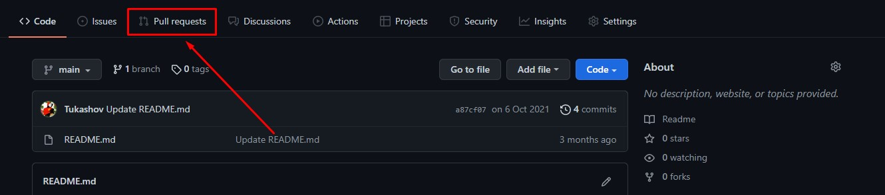
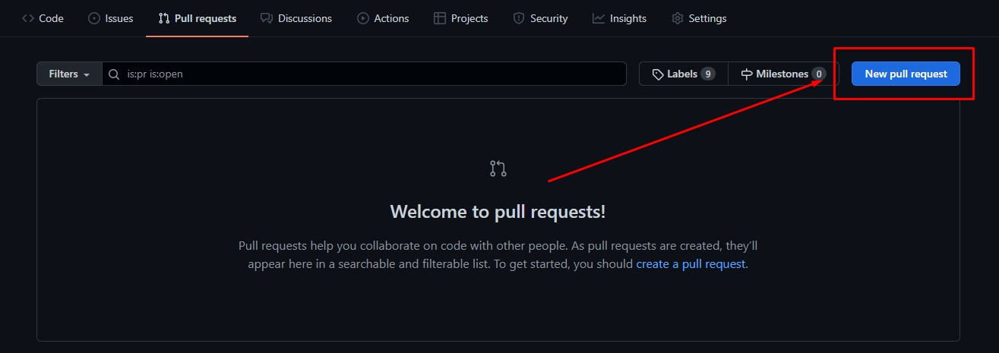
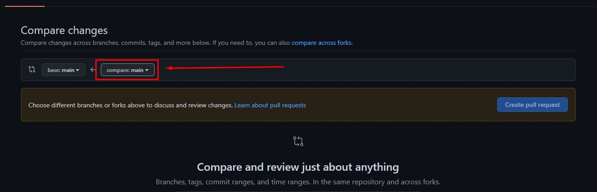
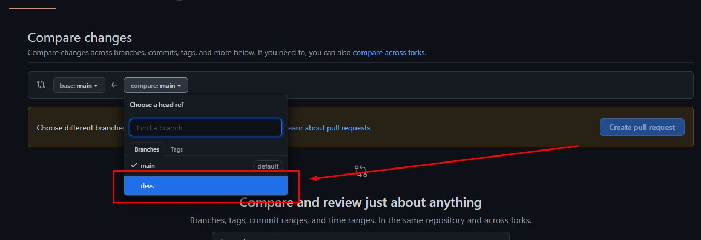
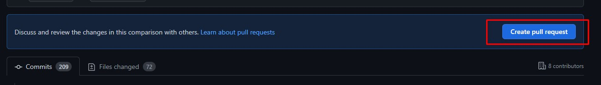
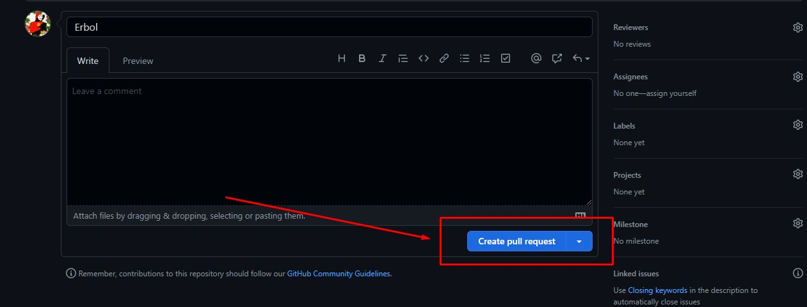
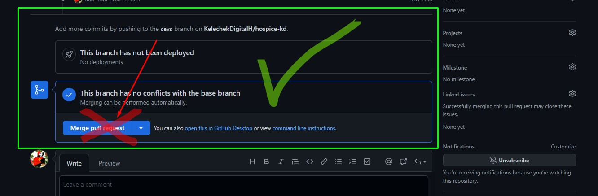

# [hospice-v1.1](https://kelechekdigitalh.github.io/hospice-v1.1/main-page "Hospice v1.1")

1. Git Bash'ты сиз иштей турган папкадан ачасыз.
2. `git clone https://github.com/KelechekDigitalH/hospice-v1.1.git` ушуну Git Bash'ка жазып Enter'ди базыңыз.
3. `cd hospice-kd` жазыңыз жана Enter'ди базыңыз.
   - бул команданын жардамы менен hospice-kd деген папканын ичине киребиз
4. `code .` жазыңыз жана Enter'ди базыңыз.
   - бул аркылуу папкабызды VSCode'тон ачып алабыз.
5. `git checkout devs` жазыңыз жана Enter'ди базыңыз.
   - Бол команда менен `devs` деген веткага өтөбүз.
6. Эми өзүңүзгө тийешелүү баракчанын үстүндө иштей берсеңиз болот.
7. Жумушуңузду бүткөндөн кийин `git add .` жазыңыз жана Enter'ди базыңыз.
8. `git commit -m "Бул жерге комментарий жазып коюуңуз кыска жана түшүнүктүү болушу керек.`
9. `git push origin devs` жазыңыз жана Enter'ди базыңыз.
10. Эми GitHub ка барып төмөнкү сүрөттөгү баскычты табыңыз (Pull requests)
    

11. Андан соң (New pull request)
    

12. Эми оң жактагы **main** веткасын басыңыз
    

13. **devs** веткасын базыңыз
    

14. **Create pull request** базыңыз
    

15. Дагы **Create pull request** базыңыз
    

16. Бүттү)) Pull request жоноткон сон Молдогазы мырзага айтып койсонуз э))
    **Merge pull request баспаңыз ×**
    
